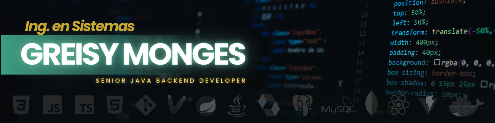

 

# ¡Hola! Soy Greisy Monges 👋
### Senior Java Backend Developer | Software Engineer

  
  
  

---

### 🚀 Sobre mí

Ingeniera en Sistemas especializada en el desarrollo de software backend empresarial dentro del ecosistema **Java (Java 8 a 21)** y **Spring Boot 3**. Enfocada en el diseño e implementación de APIs RESTful, arquitecturas modulares y microservicios, con sólida aplicación de los principios **SOLID**, **Domain-Driven Design (DDD)**, **Clean Architecture** y **Arquitectura Hexagonal**.

- 🔭 **Enfoque actual:** Construcción de servicios backend resilientes, optimización de consultas en **PostgreSQL** e integración de soluciones innovadoras como **Spring AI**.
- 🛠️ **Filosofía de desarrollo:** Elección responsable de patrones arquitectónicos según la escala del proyecto, priorizando el rendimiento, la mantenibilidad del código y las pruebas integradas.
- 🎯 **En proceso de aprendizaje:** Perfeccionamiento del idioma inglés y actualización continua en el ecosistema Java/Spring.

---

### 🛠️ Stack Tecnológico

| Categoría | Tecnologías |
| :--- | :--- |
| **Backend & Core** |       |
| **Bases de Datos** |     |
| **Arquitectura & APIs** |      |
| **Frontend & Complementos**|        |
| **Herramientas & IDEs** |     |

---

### 🏗️ Áreas de Especialización & Próximos Repositorios

Próximamente estaré publicando proyectos de código abierto y arquitecturas de referencia enfocadas en:

- ⚙️ **Monolitos Modulares & Arquitectura Hexagonal:** Implementación de patrones de Puertos y Adaptadores aislados del framework central.
- ⚡ **Servicios Distribuidos y APIs RESTful:** Desarrollo de servicios independientes con Spring Boot 3, Spring Cloud Gateway y autenticación JWT.
- 🗄️ **Persistencia Avanzada en PostgreSQL:** Casos prácticos de Spring Data JPA, soporte para tipos JSONB y optimización de consultas.
- 🤖 **Integración de IA en Java:** Módulos de automatización y parsing estructurado utilizando **Spring AI** y LLMs locales (Ollama).

<!-- 
---

### ⚙️ GitHub Analytics

  
  

-->
---

### 🤝🏻 Conéctate conmigo

  
  

  

¡Siempre abierta a conversar sobre desarrollo backend, arquitecturas de software y nuevas oportunidades profesionales! 🚀

